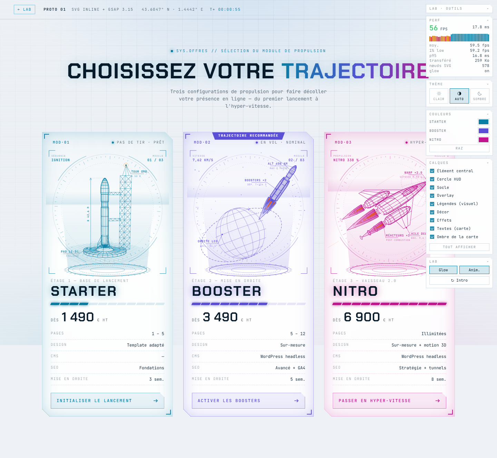

# 01 · SVG inline + GSAP

Section d'offres « Wireframe 3D / HUD Sci-Fi » (Starter / Booster / Nitro) faite **uniquement en SVG vectoriel animé par GSAP**. L'effet 3D est calculé une fois, au build, par un petit moteur de projection en Node. Le navigateur ne reçoit que du SVG 2D statique.



## Lancer

```bash
# depuis la racine du lab
npm run dev          # → http://localhost:4600/01-svg-gsap/
npm run svg:build    # régénère les 3 illustrations après modification du générateur
```

On peut aussi **ouvrir `index.html` directement** (double-clic, en `file://`) : scripts classiques, sans module ni build. Seules les webfonts Google demandent une connexion.

Raccourcis de la page : `P` affiche ou masque le compteur de perfs. Le panneau **LAB** (en bas à gauche) coupe le glow et les animations, et rejoue l'intro.

## Rendu visuel obtenu

| Offre | Illustration | Au survol (« boost ») |
|---|---|---|
| **Starter** (cyan) | Lanceur élancé (rapport 1:9) : premier étage, interétage plus étroit, second étage, coiffe ogivale, grappe de 4 moteurs et ailerons — sur son pas de tir, avec tour ombilicale en treillis, sol quadrillé, cote « H 42,6 M » et balise clignotante | Les bras ombilicaux se rétractent (morph du tracé), les moteurs s'allument et **un nuage de décollage s'ouvre de part et d'autre du carneau** (26 bouffées filaires), le compte à rebours accélère |
| **Booster** (violet) | Lanceur à 2 boosters latéraux quittant une planète filaire, orbite en pointillés animés, trajectoire, satellite en orbite (caché quand il passe derrière la planète) | Les panaches grandissent, le lanceur avance dans son axe, la trajectoire et le satellite accélèrent, la vitesse passe à 11 km/s |
| **Nitro** (magenta) | Vaisseau delta à 3 réacteurs, anneaux de post-combustion, cône d'onde de choc, traînées d'hyper-vitesse | Traînées ×4, panaches ×1,8, vibration de la coque, anneaux qui pulsent plus vite, « NITRO 514 % » |

Communs aux 3 cartes :
- **Intro « tracé »** : les lignes se dessinent (`stroke-dashoffset`), les étiquettes se « décodent » façon HUD, le prix défile, la jauge de puissance se remplit.
- **Boucles au repos** : lévitation de l'hologramme, cadran radar qui tourne, socle holographique qui pulse, ligne de balayage.
- **Pointeur** : parallaxe sur 4 calques de profondeur, légère inclinaison 3D de la carte, réticule qui suit le curseur avec ses coordonnées.
- **Lignes cachées en pointillés** (convention du dessin technique) et silhouettes plus épaisses : c'est ce qui donne le rendu « plan d'aérospatiale ».
- `prefers-reduced-motion` : tout est affiché directement, sans animation. Sans JS : le SVG complet reste visible.

## Calques et couleurs

C'est la démo la plus simple à équiper : **zéro ligne de JavaScript**. Le générateur marque chaque
groupe (`data-layer="model|ring|base|overlay|labels|decor|fx"`) et une règle CSS du lab les masque.
La couleur suit le même principe : tout est en `currentColor`, donc réécrire `--c-starter` recolore
le visuel entier, halo compris.

## Thème clair / sombre

Le visuel suit le thème du lab sans une ligne de JavaScript : tout est en `currentColor`
alimenté par les jetons CSS. En clair, les filtres de glow sont simplement coupés (`filter: none`)
et les lignes cachées sont un peu plus contrastées — le rendu devient un plan d'architecte.

## Poids des assets et performances

Mesures `npm run measure` : Chrome 153 headless piloté par Playwright, iGPU AMD Radeon 660M (ANGLE D3D11), viewport 1440×1000, DPR 1, 3 cartes à l'écran, 3 relevés de 4 s par scénario, **médiane** retenue.

| Poste | Brut | gzip |
|---|---:|---:|
| `index.html` (dont 3 SVG inline : 177 à 216 nœuds et 88 à 101 `<path>` chacun) | 92,9 Ko | 25,8 Ko |
| GSAP core 3.15 | 71,2 Ko | 27,7 Ko |
| MotionPathPlugin (servant uniquement au satellite) | 21,5 Ko | 9,5 Ko |
| CSS (habillage commun + `illu.css` + spécifique) | 15,8 Ko | 5,0 Ko |
| `main.js` | 16,6 Ko | 5,5 Ko |
| **Total en production** | **~215 Ko** | **≈ 75 Ko** |

Hors webfonts (Chakra Petch + JetBrains Mono, mutualisées avec le reste du site) et hors outillage du lab (dock, thème, calques, couleurs, compteur : ~12 Ko gzip). Le banc mesure 259 Ko transférés parce que le serveur de dev ne compresse pas et qu'il sert aussi ces outils.

| Scénario | FPS médian | 1 % low | Frame p95 |
|---|---:|---:|---:|
| Repos | 59,9 | 59,2 | 16,8 ms |
| Boost (3 cartes survolées en même temps) | 59,9 | 59,2 | 16,8 ms |
| CPU ralenti ×4 (≈ mobile milieu de gamme) | **40,5** | 29,9 | 33,4 ms |
| Sans glow (filtres SVG coupés) | 59,9 | 59,2 | 16,8 ms |

Lecture — et c'est le vrai enseignement de ce prototype :

- **60 fps sur ordinateur**, y compris avec les 3 cartes survolées. Rien à optimiser là.
- **Le glow coûte peu, contrairement à ce qu'on pourrait croire.** Mesuré en A/B alterné, CPU ralenti ×4 : 29,3 fps filtres activés contre 31,8 sans, soit ~8 %, avec surtout des à-coups plus fréquents (1 % low 10 contre 20). Deux flous gaussiens par illustration, recalculés à chaque image sur le processeur — c'est mesurable, pas rédhibitoire. Le bouton **Glow** du dock permet de le vérifier soi-même.
- **Leviers si besoin** : n'appliquer le filtre qu'au survol, remplacer le flou par un doublage de tracé (trait large et transparent sous le trait net, comme le fait le prototype 03), ou réduire `stdDeviation`. Le bouton **Glow** du panneau LAB permet de comparer en direct.
- **Sous CPU contraint** (×4, proxy d'un mobile milieu de gamme) : 40,5 fps — le meilleur des trois démos qui reposent sur le processeur. Les boucles se mettent déjà en pause hors écran ; il faudrait alléger le glow pour viser le 60 fps mobile.
- Chargement quasi instantané malgré tout : aucune texture, aucun modèle, aucun WASM.

## Facilité d'animation et de personnalisation

**Ce qui est simple**
- **Couleur** : chaque illustration est pilotée par `currentColor`. Changer `--c-starter` dans la CSS recolore tout le visuel (traits, glow, dégradés, textes).
- **Animation** : GSAP est à l'aise sur le SVG (timelines, `svgOrigin`, stagger, `attr: { d }` pour morpher un tracé, MotionPath). L'intro « tracé » tient en une ligne grâce à `pathLength="1"`, sans aucune mesure de longueur en JS.
- **Épaisseurs, pointillés, opacités** : tout passe par des classes CSS dans `css/illu.css`, qui est la source unique (réutilisée par les exports `svg/*.svg`).
- **Travail avec l'IA** : tout est du code texte (géométrie, timeline, CSS). Un LLM peut modifier une forme, une caméra ou une animation sans outil graphique.

**Ce qui est plus lourd**
- **Changer l'angle de vue** demande de régénérer : la 3D est « cuite » au build. Pas de rotation libre de l'objet en temps réel (c'est la vraie limite face à Three.js ou Spline).
- **Modifier une forme** se fait dans `tools/generate-svg.mjs` (profils de révolution, caméras, cadrages) : c'est paramétrique, pas WYSIWYG. Alternative possible : ouvrir `svg/*.svg` dans Figma ou Illustrator et retoucher à la main, en perdant alors la régénération.
- **Coût de repaint** : plus on anime de choses en même temps, plus le CPU travaille (voir CPU ×4).

| Critère | Note |
|---|:-:|
| Fidélité au style wireframe / HUD | ★★★★☆ (vectoriel net sur Retina, lignes cachées, glow, mais angle de vue figé) |
| Poids | ★★★★☆ (71 Ko gz, dont 37 Ko de GSAP) |
| Performances desktop / mobile | ★★★★★ / ★★★★☆ |
| Facilité d'animation | ★★★★☆ |
| Personnalisation (couleurs / formes) | ★★★★★ / ★★★☆☆ |
| Intégration Nuxt / SSR / SEO | ★★★★★ (markup statique, `<title>`/`<desc>`, fonctionne sans JS) |
| Productivité avec l'IA | ★★★★★ |

## Pipeline

```
tools/generate-svg.mjs  (Node, au build)
  primitives 3D : révolution (fusée, tuyères, nacelles), sphère, orbite, treillis, polygones
  → caméra perspective → tri faces avant / arrière → silhouettes
  → cadrage + simplification Ramer-Douglas-Peucker → SVG 2D (~8-10 Ko gzip par visuel)
  ├─ svg/<offre>.svg   exports autonomes (style embarqué)
  └─ index.html        injecté entre <!-- @svg:<offre> --> … <!-- /@svg:<offre> -->

js/main.js  (navigateur)
  GSAP : intro tracé → boucles idle → timelines boost (survol / focus) → parallaxe + réticule
```

## Porter dans Nuxt 4

1. Un composant par offre, avec le SVG généré collé dans le `<template>` (ou importé via `?raw` + `v-html`).
2. Dans `onMounted`, envelopper le code d'animation dans `gsap.context(() => { … }, rootEl)` et appeler `ctx.revert()` dans `onBeforeUnmount`.
3. La couleur passe par une custom property sur la carte (`--accent`), cohérent avec la règle Tailwind = layout only.
4. Charger GSAP côté client uniquement (plugin Nuxt `.client.ts`). Le SVG reste rendu en SSR, donc indexable et visible sans JS.

## Fichiers

```
01-svg-gsap/
├── index.html              page de démo (SVG injectés entre marqueurs)
├── css/illu.css            styles des illustrations (source unique page + exports)
├── css/style.css           spécifique au proto (l'habillage des cartes est dans ../_shared/offers.css)
├── js/main.js              intro, boucles, boost, parallaxe, réticule
├── tools/generate-svg.mjs  moteur 3D → SVG (caméras, formes, étiquettes)
├── svg/*.svg               exports autonomes des 3 illustrations
├── vendor/                 GSAP 3.15 + MotionPathPlugin (vendorisés, fonctionne hors ligne)
└── preview.png             capture générée par npm run measure
```

Les prix et contenus des offres sont **fictifs** (placeholders de démo).
