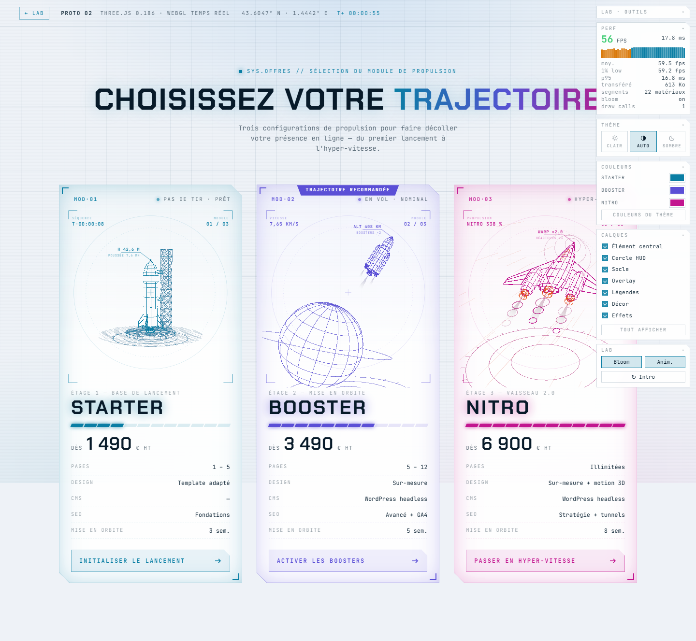

# 02 · Three.js (WebGL temps réel)

Même section d'offres, mais les trois engins sont de **vrais objets 3D** rendus par le GPU à chaque image : ils tournent, les lignes cachées sont réellement masquées par des volumes, et le néon vient d'une passe de **bloom**.



## Lancer

```bash
npm run build:02     # depuis la racine du lab (installe puis compile dans dist/)
npm run dev          # → http://localhost:4600/02-threejs-r3f/dist/
```

Contrairement au prototype 01, **cette démo ne s'ouvre pas en double-clic** : elle utilise des modules ES, que le navigateur refuse en `file://`. Il faut le serveur (ou n'importe quel hébergement statique).

Pendant le développement : `npm run dev` dans `02-threejs-r3f/` lance Vite avec rechargement à chaud.

## Pourquoi Three.js « nu » et pas React Three Fiber

R3F est une surcouche **React**. La stack PropulSite est Nuxt / Vue : l'équivalent y est **TresJS** (`@tresjs/core`), qui expose la même idée (chaque objet 3D devient un composant). Le code de ce prototype est volontairement découpé pour être transposable tel quel :

- `src/wire.ts` — primitives filaires (révolution, sphère, treillis, anneaux, panaches)
- `src/scenes.ts` — les 3 scènes et leur logique d'animation
- `src/main.ts` — rendu, post-traitement, interactions

Dans Nuxt, `wire.ts` et `scenes.ts` ne bougent pas ; seul `main.ts` devient un composant Vue (ou des composants TresJS).

## Ce que la 3D temps réel apporte ici

- **Rotation libre** : chaque scène tourne en continu et suit le pointeur. C'est la limite que le prototype 01 ne peut pas franchir (son angle de vue est figé au build).
- **Lignes cachées exactes** : un volume noir opaque (« occludeur ») est glissé dans chaque coque, planète et nacelle. Le tampon de profondeur fait le tri — là où le prototype 01 doit calculer les faces vues puis dessiner les autres en pointillés.
- **Bloom** : le halo néon est calculé en post-traitement sur toute l'image (`UnrealBloomPass`), au lieu d'un filtre par objet.
- **Un seul contexte WebGL pour 3 cartes** : un canvas plein écran en `mix-blend-mode: screen`, et à chaque frame on dessine chaque scène dans le rectangle de sa carte (`viewport` + `scissor`). Résultat : **1 seul draw call par frame** côté composeur, et rien n'empêche d'en ajouter 6 autres.
- **Au survol** : les bras de la tour pivotent (une rotation 3D, là où le SVG devait morpher un tracé), les panaches s'allongent, le lanceur avance dans son axe, le vaisseau vibre et les traînées accélèrent.

## Calques et couleurs

Les objets 3D portent un marqueur (`userData.layer`) et le panneau Calques bascule leur `visible`.
Le marquage est posé sur les **feuilles** de la scène, jamais sur les groupes : éteindre le vaisseau
laisse donc ses flammes et ses anneaux allumés, puisqu'ils sont des objets frères et non enfants.

Le HUD (cercle, légendes, coins) reste du DOM au-dessus du canvas : il suit la même règle CSS que
les autres démos. Les couleurs, elles, sont relues dans les jetons CSS à chaque changement de thème
ou de teinte, puis appliquées matériau par matériau selon son rôle.

## Thème clair / sombre

C'est la démo qui a demandé le plus d'adaptation. En clair : le canvas passe de
`mix-blend-mode: screen` à `multiply`, le fond et les occludeurs deviennent blancs, le bloom est
coupé (il délaverait tout) et chaque matériau est reteinté selon son rôle (`accent`, `hot`,
`plume`, `bg`) à partir des jetons CSS. Un rappel utile : en WebGL, rien ne suit la CSS tout seul.

## Poids et performances

Mesures `npm run measure` : Chrome 153 headless (Playwright), iGPU AMD Radeon 660M (ANGLE D3D11), viewport 1440×1000, 3 relevés de 4 s par scénario, médiane retenue.

| Poste | Brut | gzip |
|---|---:|---:|
| Bundle JS (three.js + post-traitement + scènes + outillage du lab) | 590 Ko | 151,0 Ko |
| CSS | 11,1 Ko | 3,4 Ko |
| HTML | 10,3 Ko | 2,3 Ko |
| **Total mesuré** | **613 Ko** | **≈ 157 Ko** |
| **Total en production** (sans l'outillage du lab) | — | **≈ 148 Ko** |

C'est **le double du prototype 01** (72 Ko) et **8 fois le prototype 03** (18 Ko). Three.js tree-shaké reste gros ; le post-traitement ajoute ~25 Ko.

| Scénario | FPS médian | 1 % low | Frame p95 |
|---|---:|---:|---:|
| Repos | 59,9 | 59,5 | 16,8 ms |
| Boost (3 cartes survolées) | 59,9 | 59,5 | 16,8 ms |
| CPU ralenti ×4 (≈ mobile) | **48,4** | 20,0 | 33,4 ms |
| Sans bloom | 59,9 | 59,5 | 16,8 ms |

**C'est la démo la plus stable des quatre**, et de loin la meilleure sous CPU contraint (48,4 fps contre 22 pour le SVG et 25 pour le Canvas 2D) : le travail est fait par le GPU, le CPU ne fait que mettre à jour des matrices. Le bloom ne coûte presque rien ici.

À nuancer : le chargement est plus lourd (1,3 s contre 1,0 s) et il faut un GPU. Sur une machine sans accélération (vieux parc, VM, certains environnements d'entreprise), le rendu bascule en logiciel et s'effondre — cas où le SVG reste imbattable.

## Facilité d'animation et de personnalisation

**Simple**
- Changer une forme : éditer un profil dans `scenes.ts`, la 3D suit (pas de régénération).
- Changer la couleur : une constante dans `main.ts` (`COLORS`).
- Le survol, les vibrations, les rotations : quelques lignes d'interpolation dans la boucle.

**Plus coûteux**
- **Pas de timeline** : sans GSAP, chaque transition s'écrit à la main (`lerp` vers une cible). Le séquencement fin de l'intro du prototype 01 (tracé progressif, décalages, décodage des étiquettes) demanderait ici soit GSAP en plus, soit des shaders dédiés.
- **Le texte reste en DOM** : les étiquettes HUD sont en SVG au-dessus du canvas, et l'étiquette ancrée à la pointe de la fusée est reprojetée à chaque frame (`anchor.project(camera)`). WebGL ne fait pas de texte net gratuitement.
- **Pas de SSR** : rien n'est visible sans JavaScript, et rien n'est indexable. Pour une section d'offres commerciale, il faut prévoir un rendu de repli.

| Critère | Note |
|---|:-:|
| Fidélité au style wireframe / HUD | ★★★★★ |
| Poids | ★★☆☆☆ (151 Ko gz) |
| Performances desktop / mobile | ★★★★★ / ★★★★☆ |
| Facilité d'animation | ★★★☆☆ (tout à la main, sans timeline) |
| Personnalisation (couleurs / formes) | ★★★★★ |
| Intégration Nuxt / SSR / SEO | ★★☆☆☆ (client only) |
| Productivité avec l'IA | ★★★★★ (les LLM connaissent bien Three.js) |

## Fichiers

```
02-threejs-r3f/
├── index.html          page (cartes + canvas plein écran + HUD SVG)
├── src/wire.ts         primitives filaires → LineSegments2 (lignes épaisses)
├── src/scenes.ts       les 3 scènes, occludeurs, panaches, animation
├── src/main.ts         multi-vues (viewport + scissor), bloom, interactions
├── src/style.css       canvas et HUD (l'habillage des cartes vient de ../_shared/offers.css)
├── vite.config.js      base relative, build vers dist/
└── dist/               build servi par le lab et mesuré par npm run measure
```

Les prix et contenus des offres sont **fictifs** (placeholders de démo).
