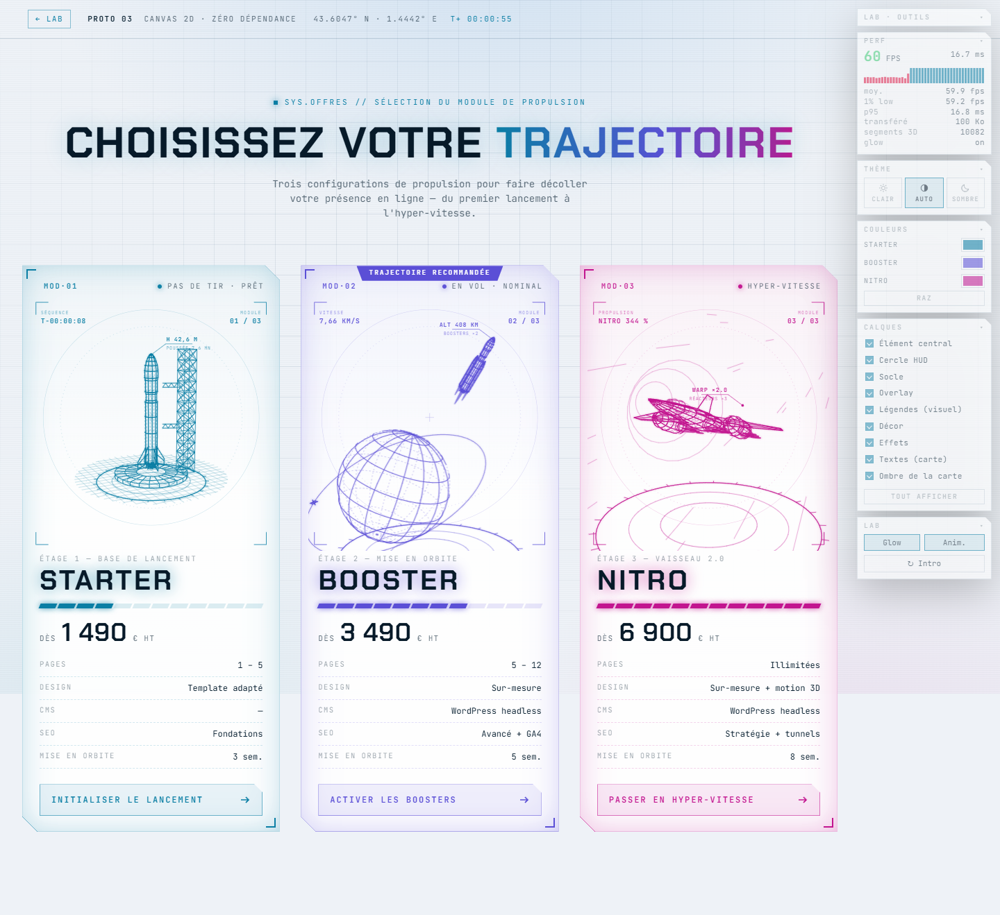

# 03 · Canvas 2D (projection 3D maison)

Le moteur du prototype 01, mais **exécuté à chaque image dans le navigateur** au lieu d'être pré-calculé : mêmes formes, mêmes lignes cachées en pointillés — et en plus la rotation libre. Zéro dépendance, zéro build.



## Lancer

```bash
npm run dev          # → http://localhost:4600/03-canvas-glsl/
```

Ou **double-clic sur `index.html`** : scripts classiques, aucun module, aucune librairie.

## Comment ça marche

```
js/engine.js   primitives 3D (révolution, sphère, anneau, treillis, grille)
               → arbre de nœuds (position / rotation / échelle)
               → projection perspective + tri des faces vues et cachées, chaque frame
               → tracé Canvas 2D par lots (un seul `stroke` par épaisseur de trait)
js/scenes.js   les 3 scènes, identiques aux prototypes 01 et 02
js/main.js     boucle, survol, intro, HUD, panneau LAB
```

Deux détails qui font la différence de performance :

- **Regroupement des tracés.** Chaque appel à `stroke()` coûte cher en Canvas 2D. Les ~6 900 segments sont regroupés par épaisseur et opacité, puis tracés en quelques appels seulement.
- **Glow sans filtre.** Pas de `shadowBlur` (très lent) : chaque groupe est dessiné deux fois, une passe large et transparente en mélange additif (`globalCompositeOperation = 'lighter'`), puis le trait net par-dessus.

## Calques et couleurs

Chaque nœud de la scène porte son calque. Quand il est éteint, le moteur saute **ses** traits mais
continue de descendre vers ses enfants : masquer le vaisseau laisse donc ses flammes visibles, alors
qu'un simple `visible = false` sur le groupe les aurait emportées. Le HUD, lui, est du SVG en
surimpression, masqué par la règle CSS commune. La couleur du renderer est relue dans le jeton
`--c-<offre>` à chaque changement.

## Thème clair / sombre

En clair, le mélange additif (`globalCompositeOperation = 'lighter'`), qui fait tout l'effet néon
sur fond noir, éclaircirait l'encre : il repasse en tracé normal, et les traits sont épaissis de
25 % pour compenser la disparition du halo. Deux lignes dans le moteur, pilotées par un booléen.

## Poids et performances

Mesures `npm run measure` : Chrome 153 headless (Playwright), viewport 1440×1000, 3 relevés de 4 s par scénario, médiane retenue.

| Poste | Brut | gzip |
|---|---:|---:|
| `engine.js` (moteur 3D complet) | 14,6 Ko | 4,6 Ko |
| `scenes.js` (les 3 illustrations) | 10,3 Ko | 3,2 Ko |
| `main.js` | 7,9 Ko | 2,8 Ko |
| CSS (habillage commun + spécifique) | 15,3 Ko | 5,0 Ko |
| HTML | 10,5 Ko | 2,3 Ko |
| **Total en production** | **62 Ko** | **≈ 19 Ko** |

**C'est le poids le plus faible des quatre** : 4 fois plus léger que le SVG + GSAP, 7 fois plus léger que Three.js. (Le banc affiche 100 Ko transférés : non compressé, et outillage du lab inclus.) Et les illustrations ne sont pas des assets : elles sont *calculées*, donc ajouter une quatrième offre ne coûte que quelques lignes.

| Scénario | FPS médian | 1 % low | Frame p95 |
|---|---:|---:|---:|
| Repos | 59,9 | 59,2 | 16,8 ms |
| Boost (3 cartes survolées) | 59,4 | 59,2 | 16,8 ms |
| CPU ralenti ×4 (≈ mobile) | **23,1** | 12,0 | 50,3 ms |
| Sans glow | 59,9 | 59,5 | 16,8 ms |

Lecture honnête : **60 fps sur desktop, mais c'est la démo la plus fragile sous CPU contraint** (23,1 fps, à-coups à 12 fps) — les deux tiers du prototype SVG, moins de la moitié de Three.js. Logique : tout est fait par le processeur — projeter 6 900 segments, les trier vus/cachés, puis les peindre, 60 fois par seconde. Sur mobile, il faudrait réduire la densité des maillages (moins de méridiens, moins d'anneaux) ou n'animer que la carte visible.

## Facilité d'animation et de personnalisation

**Simple**
- Tout est du JavaScript lisible : changer un profil, une caméra, une vitesse de rotation se fait en une ligne.
- Une seule couleur par scène (`color` du renderer) pilote tout le rendu.
- Aucun outil, aucune chaîne de build : on édite, on recharge.

**Plus coûteux**
- **Tout est à écrire à la main** : pas de timeline, pas de plugin, pas de moteur physique. Les transitions sont des interpolations maison.
- **Pas d'élimination des surfaces cachées** : comme en SVG, les lignes du fond restent visibles (en pointillés). Un rendu « solide » demanderait un algorithme du peintre ou un tampon de profondeur — c'est exactement ce que WebGL offre gratuitement (prototype 02).
- **Rien n'est visible sans JavaScript** et rien n'est indexable : le canvas est une image opaque pour Google, contrairement au SVG du prototype 01.

| Critère | Note |
|---|:-:|
| Fidélité au style wireframe / HUD | ★★★★☆ |
| Poids | ★★★★★ (16 Ko gz) |
| Performances desktop / mobile | ★★★★★ / ★★☆☆☆ |
| Facilité d'animation | ★★★☆☆ |
| Personnalisation (couleurs / formes) | ★★★★★ |
| Intégration Nuxt / SSR / SEO | ★★☆☆☆ (client only) |
| Productivité avec l'IA | ★★★★☆ |

## Et la variante GLSL ?

Le brief laissait le choix « Canvas 2D **ou** shader GLSL ». Le Canvas 2D a été retenu parce qu'il isole proprement **le coût CPU pur** : c'est le point de comparaison manquant entre le SVG pré-calculé (01) et le GPU (02). Une variante WebGL brut déplacerait ce coût vers la carte graphique — c'est déjà ce que mesure le prototype 02, en mieux outillé.

## Fichiers

```
03-canvas-glsl/
├── index.html      page (3 canvas + HUD SVG)
├── js/engine.js    moteur : primitives, arbre de nœuds, projection, tri, tracé
├── js/scenes.js    les 3 scènes
├── js/main.js      boucle et interactions
└── css/style.css   canvas et HUD (habillage commun : ../_shared/offers.css)
```

Le moteur de ce prototype est réutilisé tel quel par le prototype 04 (`<wire-rocket>`).

Les prix et contenus des offres sont **fictifs** (placeholders de démo).
