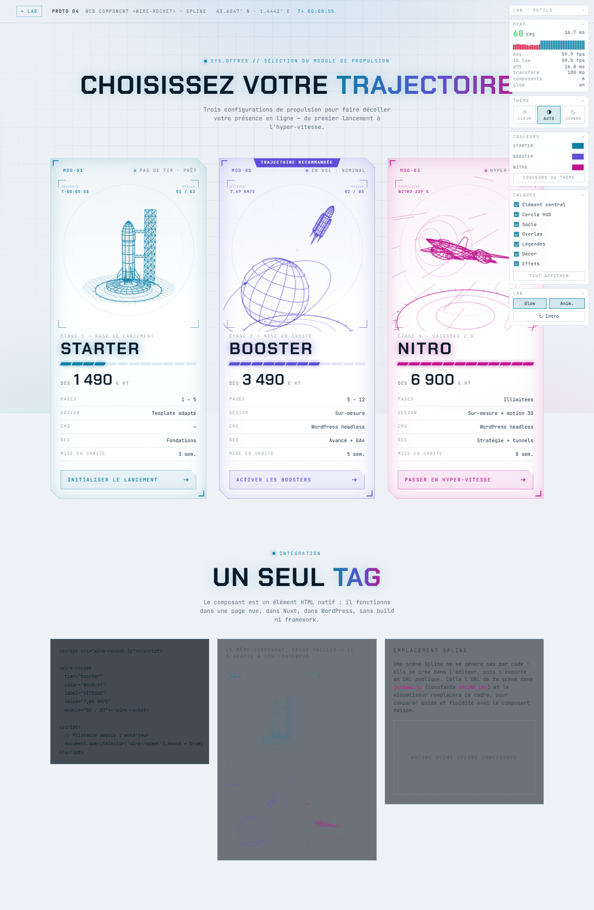

# 04 · Web Component `<wire-rocket>` (+ chemin Spline)

La même illustration, mais empaquetée dans un **élément HTML natif** : un fichier, un tag, et ça marche partout — page nue, Nuxt, WordPress, Webflow — sans framework ni build.



## Lancer

```bash
npm run bundle:04    # assemble dist/wire-rocket.js
npm run dev          # → http://localhost:4600/04-spline-web/
```

Ou **double-clic sur `index.html`**.

## Utilisation

```html
<script src="wire-rocket.js"></script>

<wire-rocket
  tier="booster"          <!-- starter | booster | nitro -->
  color="#9d8cff"
  label="VITESSE" value="7,66 KM/S" module="02 / 03"></wire-rocket>

<script>
  const el = document.querySelector('wire-rocket');
  el.boost = true;                    // état « survolé », pilotable de l'extérieur
  el.setAttribute('value', '11,2 KM/S');
  el.addEventListener('boostchange', (e) => console.log(e.detail.boost));
</script>
```

Attributs : `tier`, `color`, `label`, `value`, `module`, `glow="off"`, `boost`, `paused`.
Propriété : `.boost` (booléen). Événement : `boostchange`.

Le composant :
- s'anime seul et **se met en pause hors écran** (IntersectionObserver) ;
- respecte `prefers-reduced-motion` ;
- nettoie sa boucle d'animation quand on le retire du DOM (`disconnectedCallback`) ;
- isole son style dans un **Shadow DOM** : aucune CSS de la page ne peut le casser, et il ne pollue rien (le `part="canvas"` / `part="hud"` reste stylable si besoin).

Dans Nuxt, il s'utilise tel quel (`<wire-rocket :key="tier" tier="nitro" />` après avoir déclaré `wire-rocket` comme custom element dans `vue.compilerOptions.isCustomElement`).

## Ce que le prototype démontre

La page contient les 3 cartes d'offre, puis une section « intégration » avec le snippet, **le même composant à trois tailles** (il s'adapte à son conteneur) et l'emplacement Spline.

Le rendu interne est le moteur Canvas 2D du prototype 03, assemblé par `tools/bundle.mjs` : moteur + scènes + élément, le tout dans une IIFE (aucune variable globale n'est exposée). L'intérêt n'est donc pas le rendu — déjà mesuré en 03 — mais **le mode de distribution**.

## Calques et couleurs

Cas particulier : **la CSS de la page n'entre pas dans un Shadow DOM**. Le composant ne peut donc pas
compter sur la règle commune du lab — il écoute l'événement `layerchange`, transmet les calques à son
moteur et masque lui-même les éléments de son HUD interne. Même logique pour la couleur : sans
attribut `color`, il lit celle que la page lui donne et se remet à jour sur `themechange`.

C'est la contrepartie de l'encapsulation : rien ne peut le casser de l'extérieur, mais il doit
exposer explicitement ce qu'on veut piloter.

## Thème clair / sombre

Le composant n'impose pas ses couleurs : sans attribut `color`, il hérite de la couleur CSS de son
hôte (la page gagne toujours sur `:host`) et écoute l'événement `themechange`. Déposé dans
n'importe quelle page, il suit donc le thème de celle-ci, sans configuration.

## Poids et performances

| Poste | Brut | gzip |
|---|---:|---:|
| `dist/wire-rocket.js` (moteur + 3 scènes + élément) | 34,1 Ko | **10,2 Ko** |
| Page de démo (HTML + CSS + pilotage) | 28,5 Ko | 9,4 Ko |
| **Total page en production** | **63 Ko** | **≈ 20 Ko** |

Un site qui n'a besoin que du visuel n'embarque donc que **10,2 Ko compressés** — tout compris, illustrations comprises. (Le banc affiche 100 Ko transférés : non compressé, outillage du lab inclus.)

| Scénario | FPS médian | 1 % low | Frame p95 |
|---|---:|---:|---:|
| Repos (6 composants sur la page, 3 en pause hors écran) | 55,2 | 29,9 | 16,8 ms |
| Boost | 59,7 | 59,2 | 16,8 ms |
| CPU ralenti ×4 (≈ mobile) | 30,0 | 19,9 | 50,2 ms |
| Sans glow | 59,9 | 59,2 | 16,8 ms |

À retenir : **même moteur que le 03, mais meilleur sous CPU contraint** (30 contre 25 fps), parce que chaque composant se met en pause dès qu'il sort de l'écran — un comportement offert par l'encapsulation.

## Et Spline ?

**Je ne peux pas fabriquer une scène Spline par code.** Le format `.splinecode` est propriétaire, sans API d'écriture publique, et l'IA de génération de Spline vit dans leur éditeur (compte requis). Deux chemins restent ouverts :

1. **Tu crées les scènes dans Spline** (matériau wireframe + glow, états au survol via leurs *events*), tu exportes en URL publique, et tu la colles dans la constante `SPLINE_URL` de `js/demo.js`. Le visualiseur `@splinetool/viewer` remplace alors le cadre vide de la section « intégration », et `npm run measure` compare directement poids et fluidité avec le composant maison.
2. **Tu pars du filaire existant** : les géométries des 3 scènes peuvent être exportées en glTF pour être importées dans Spline ou Blender, puis retravaillées visuellement.

Ordre de grandeur à anticiper : le runtime Spline pèse ~1 à 3 Mo selon la scène, contre 10,2 Ko ici. L'échange se fait donc entre **temps d'édition visuelle** (Spline gagne largement) et **poids / contrôle** (le code gagne largement).

| Critère | Note |
|---|:-:|
| Fidélité au style wireframe / HUD | ★★★★☆ |
| Poids | ★★★★★ (10,2 Ko gz le composant) |
| Performances desktop / mobile | ★★★★★ / ★★★☆☆ |
| Facilité d'animation | ★★★☆☆ (héritée du 03) |
| Réutilisation / portabilité | ★★★★★ (un tag, partout, sans build) |
| Intégration Nuxt / SSR / SEO | ★★★☆☆ (client only, mais encapsulé et sans conflit CSS) |
| Édition visuelle sans code | ★☆☆☆☆ — c'est là que Spline prendrait le relais |

## Fichiers

```
04-spline-web/
├── index.html              cartes + section « intégration » (snippet, tailles, emplacement Spline)
├── src/wire-rocket.js      l'élément personnalisé (Shadow DOM, cycle de vie, attributs)
├── tools/bundle.mjs        assemble moteur 03 + scènes + élément → dist/wire-rocket.js
├── js/demo.js              pilotage de la page (télémétrie, panneau LAB, emplacement Spline)
├── css/style.css           habillage de la section (cartes : ../_shared/offers.css)
└── dist/wire-rocket.js     le composant distribuable
```

Les prix et contenus des offres sont **fictifs** (placeholders de démo).
