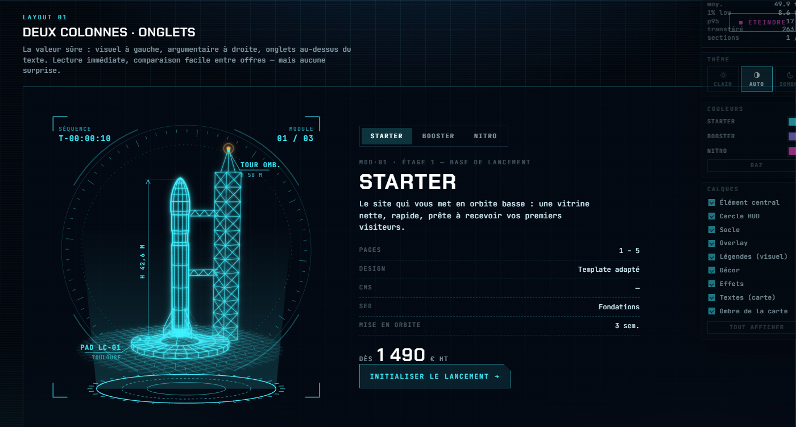

# Banc de layouts — une offre à la fois

Les quatre prototypes comparent des **technologies**. Cette page compare des **partis pris de
mise en page** : une seule offre à l'écran, et six façons différentes de passer de l'une à l'autre.



## Lancer

```bash
npm run dev    # → http://localhost:4600/test-layout/
```

Ou double-clic sur `index.html`. Aucune compilation.

## Pourquoi le SVG

Tous les layouts utilisent **le visuel du prototype 01** (SVG inline + GSAP), volontairement :
c'est la technologie la plus simple du lab — pas de build, pas de contexte WebGL, un simple
markup qu'on injecte. Comme on peut afficher jusqu'à six sections en même temps, c'était aussi
la moins risquée pour la fluidité. Les trois visuels viennent de `js/svg-data.js`, généré par le
prototype 01 : une seule source, aucun doublon.

## Une section prend toute la largeur

Aucune section n'est bridée par une largeur de page : la bordure, le fond et le visuel vont
d'un bord à l'autre de l'écran. Ce sont les **blocs à l'intérieur** (colonne de texte à 62 ch,
carte, panneau, grille de specs) qui se limitent, là où la lecture l'exige.

Le dock d'outils passe **par-dessus** la page plutôt que de lui manger une colonne. Il s'estompe
au repos, et les layouts ne décalent leur contenu vers la gauche que si l'écran ne laisse pas
la place de passer à côté (`--dock-clear` dans `css/style.css`, nul au-delà de ~1780 px).

## Rien ne démarre tout seul

C'est la règle de la page. Chaque section est **en veille** au chargement : ni visuel injecté,
ni animation, ni timeline. Un clic sur **Lancer** la réveille, **Éteindre** libère tout
(timelines tuées, DOM vidé — vérifié : plus aucune animation dans GSAP après extinction).
Une section sortie de l'écran met ses boucles en pause.

Concrètement, la page se charge avec **0 SVG monté** et n'anime que ce qu'on lui demande.

## Les six layouts

Chacun apporte **sa propre logique de sélection** — c'est justement ce qu'on compare :

| # | Layout | Sélection | Ce qu'on teste |
|---|---|---|---|
| 01 | Deux colonnes | Onglets segmentés | La valeur sûre : lecture immédiate, comparaison facile, zéro surprise |
| 02 | Hero centré | Ascenseur d'étages (1·2·3) | Le visuel domine ; la montée en gamme se lit comme une trajectoire |
| 03 | Immersif | Carrousel : paire de flèches sous le texte, points, clavier ←/→ | Spectaculaire, mais le texte se bat contre l'image |
| 04 | Fiche technique | Explorateur de modules avec prix | Pour l'acheteur qui compare : rationnel, dense, peu émotionnel |
| 05 | Pile de cartes | Clic sur une carte du fond | Garde le choix sous les yeux sans afficher trois blocs complets |
| 06 | Levier de poussée | Curseur 1 → 3 + jauge | La sélection devient un geste ; ludique, très thématique, à valider avec de vrais visiteurs |

Changement d'offre : fondu sortant (~0,2 s) puis **la nouvelle offre se redessine** (l'intro
« tracé » du SVG est rejouée), ce qui donne sa valeur au changement plutôt qu'un simple échange
d'images.

## Ce que la page ne tranche pas

Elle montre des options, elle ne les départage pas. Pour décider, il faut regarder :

- **le nombre de clics** pour comparer deux offres (les onglets gagnent, le levier perd) ;
- **la lisibilité du prix** au premier coup d'œil (l'immersif le noie, la fiche technique l'expose) ;
- **ce qui reste visible** des offres non sélectionnées (la pile les garde, le hero les oublie) ;
- **le comportement mobile** : tous passent en une colonne, mais le carrousel et la pile
  demandent une vraie adaptation tactile.

## Fichiers

```
test-layout/
├── index.html        les six sections, en veille
├── css/style.css     ossature de la page + les six mises en page
├── js/offers.js      contenu des trois offres (source unique)
├── js/svg-data.js    visuels générés par le prototype 01 (npm run svg:build)
└── js/main.js        montage / démontage par section, transitions, sélecteurs
```

Les contenus et prix sont **fictifs** (placeholders de démo).
