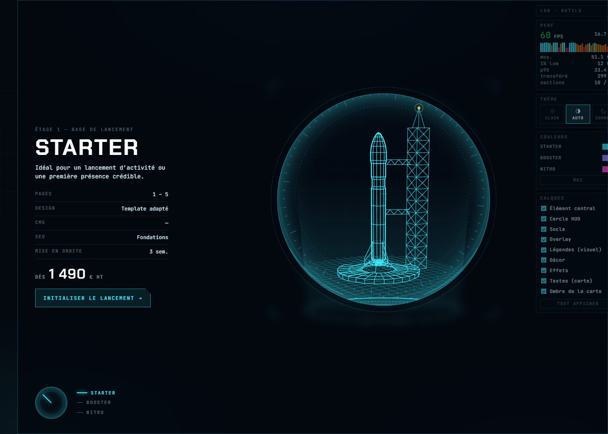

# Banc de layouts — une offre à la fois

Les quatre prototypes comparent des **technologies**. Cette page compare des **partis pris de
mise en page** : une seule offre à l'écran, et onze façons différentes de passer de l'une à l'autre.

Elle se lit en deux familles :

1. **01 → 06** — le visuel et le texte **partagent un conteneur** : ils sont voisins.
2. **07 → 11** — le visuel passe **en fond de section** et la définition de l'offre flotte
   au-dessus. C'est là que se joue la profondeur.



## Lancer

```bash
npm run dev    # → http://localhost:4600/test-layout/
```

Ou double-clic sur `index.html`. Aucune compilation.

## Pourquoi le SVG

Tous les layouts utilisent **le visuel du prototype 01** (SVG inline + GSAP), volontairement :
c'est la technologie la plus simple du lab — pas de build, pas de contexte WebGL, un simple
markup qu'on injecte. Comme on peut afficher onze sections en même temps, c'était aussi la moins
risquée pour la fluidité. Les trois visuels viennent de `js/svg-data.js`, généré par le
prototype 01 : une seule source, aucun doublon.

## Une section = un écran

Chaque mise en page occupe **toute la hauteur du viewport** (`100svh`, pas `100vh` : sur mobile
la barre d'URL ne doit pas tronquer) et **toute la largeur** : la bordure, le fond et le visuel
vont d'un bord à l'autre. Ce sont les **blocs à l'intérieur** (colonne de texte à 62 ch, carte,
panneau, grille de specs) qui se limitent, là où la lecture l'exige. C'est la seule façon
honnête de juger une section d'offre : on la découvre toujours ainsi.

Corollaire : **le visuel se règle sur cette hauteur et ne la dépasse jamais.** Dans la première
famille, il est borné par `--illu-max` (de 46 vh pour la fiche technique à 74 vh pour les deux
colonnes) ; dans la seconde, son plan reste à l'intérieur de la section avec une marge de 3-4 %
que la parallaxe consomme. Une section en veille, elle, ne prend que 42 vh — onze cadres vides à
faire défiler, ce serait la page la moins agréable du lab.

> Le dessin fait 400 × 420 : posé dans une section large et basse, il se règle sur la hauteur et
> laisse donc de l'air sur les côtés. C'est assumé — c'est le prix du « rien n'est coupé ».
> Les volets (09) en tiennent compte : leurs lames se resserrent autour du dessin, sinon le verre
> dépoli n'aurait rien à flouter derrière lui.

Le dock d'outils passe **par-dessus** la page plutôt que de lui manger une colonne. Il s'estompe
au repos, et les layouts ne décalent leur contenu vers la gauche que si l'écran ne laisse pas
la place de passer à côté (`--dock-clear` dans `css/style.css`, nul au-delà de ~1780 px).

## Rien ne démarre tout seul

C'est la règle de la page. Chaque section est **en veille** au chargement : ni visuel injecté,
ni animation, ni timeline. Un clic sur **Lancer** la réveille, **Éteindre** libère tout
(timelines tuées, écouteurs de parallaxe retirés, DOM vidé — vérifié : plus aucune animation
dans GSAP après extinction). Une section sortie de l'écran met ses boucles en pause.

Concrètement, la page se charge avec **0 SVG monté** et n'anime que ce qu'on lui demande.

## Famille 1 — le visuel à côté du texte

| # | Layout | Sélection | Ce qu'on teste |
|---|---|---|---|
| 01 | Deux colonnes | Onglets segmentés | La valeur sûre : lecture immédiate, comparaison facile, zéro surprise |
| 02 | Hero centré | Ascenseur d'étages (1·2·3) | Le visuel domine ; la montée en gamme se lit comme une trajectoire |
| 03 | Immersif | Carrousel : paire de flèches sous le texte, points, clavier ←/→ | Spectaculaire, mais le texte se bat contre l'image |
| 04 | Fiche technique | Explorateur de modules avec prix | Pour l'acheteur qui compare : rationnel, dense, peu émotionnel |
| 05 | Pile de cartes | Clic sur une carte du fond | Garde le choix sous les yeux sans afficher trois blocs complets |
| 06 | Levier de poussée | Curseur 1 → 3 + jauge | La sélection devient un geste ; ludique, très thématique, à valider avec de vrais visiteurs |

## Famille 2 — le visuel en fond, l'offre au-dessus

Même matière, mais le visuel n'est plus un bloc voisin : c'est le **décor**. Chaque layout
répond alors à la même question — *comment poser du texte sur une image sans la tuer ?* — avec
un outil de profondeur différent.

| # | Layout | Profondeur | Sélection | Ce qu'on teste |
|---|---|---|---|---|
| 07 | Poste de pilotage | Parallaxe inversée : le fond suit la souris, le panneau résiste | Trois interrupteurs à bascule | La plus sage des cinq : le texte garde son bloc, le décor respire derrière |
| 08 | Typographie évidée | Les lettres **fusionnent** avec le visuel (`mix-blend-mode`), la fiche flotte au-dessus | Les trois noms en très grand **sont** le menu | Très affirmé graphiquement ; à réserver à une marque qui assume |
| 09 | Volets de verre | Le flou se fait **derrière** les lames (`backdrop-filter`) | Clic sur une lame fermée | Garde les trois offres à l'écran sans les afficher trois fois |
| 10 | Hublot | Un masque radial : net dans le disque, flou et sombre autour | Molette à trois crans | La profondeur sert directement la lisibilité — le texte se lit sur le flou |
| 11 | Diorama | **Vraie** perspective CSS : chaque plan a sa distance, la scène pivote au pointeur | Étiquettes posées à des profondeurs différentes | Le plus spectaculaire ; attention aux bords, un plan avancé sort vite du cadre |

Trois règles communes à cette famille, dans `css/style.css` :

- le plan de fond **reste dans la section** et garde une marge de 3-4 % que la parallaxe
  consomme, pour ne découvrir aucun bord sans jamais rogner le dessin ;
- un **voile dégradé** s'intercale toujours entre le visuel et le texte, et le contenu porte son
  propre fond translucide — jamais de texte posé à nu sur le trait ;
- en fond, le visuel **perd ses légendes et son halo** (`.illu--bg`) : deux typographies
  concurrentes à deux échelles, c'en est une de trop, et un flou gaussien agrandi 2× coûte cher
  pour un plan qu'on regarde à peine. Le calque « Légendes » du dock n'a donc pas d'effet ici.

## Changer d'offre

Fondu sortant (~0,2 s) puis **la nouvelle offre se redessine** : l'intro « tracé » du SVG est
rejouée. Le changement a ainsi une valeur en soi, au lieu d'être un simple échange d'images.

## Ce que ça coûte

Relevé sur la machine du lab, 1920 × 1000, une seule section allumée et visible (médiane de 3) :

| Layout | FPS | Layout | FPS |
|---|---:|---|---:|
| 01 Deux colonnes | 59,6 | 08 Typographie évidée | **54,3** |
| 03 Immersif | 60,2 | 09 Volets de verre | 60,0 |
| 07 Poste de pilotage | 60,1 | 10 Hublot | 60,0 |
| | | 11 Diorama | 60,0 |

**Les onze allumées en même temps (une seule visible) : 48,3 fps** — les sections hors écran
mettent leurs boucles en pause, c'est ce qui sauve la page.

Deux enseignements : le verre dépoli et le masque radial, qui *semblent* coûteux, ne coûtent
presque rien parce qu'ils sont statiques ; le mode de fusion, lui, se paie — il doit être
recomposé à chaque image du visuel qui passe dessous. Le limiter au seul mot allumé (au lieu
des trois) a rendu 15 fps au layout 08.

## Sur téléphone

Les onze tiennent en une colonne, mais pas de la même façon — et c'est un bon révélateur :

| Layout | Ce qui change en petit écran |
|---|---|
| 01 · 06 | Une colonne, visuel au-dessus du texte. Rien à négocier. |
| 02 Hero | L'ascenseur d'étages passe en rangée horizontale défilante. |
| 03 Immersif | Le voile passe de gauche-droite à haut-bas — le texte tombe en plein milieu du vaisseau, il faut le charger. |
| 04 Fiche technique | L'explorateur passe au-dessus, en liste. |
| 05 Pile | Les cartes du fond deviennent deux lignes compactes au-dessus — la perspective ne survit pas, la hiérarchie oui. |
| 07 Poste de pilotage | Le fond s'efface à 50 % : le panneau prend toute la largeur, il doit rester lisible. |
| 08 Typographie | Les noms rétrécissent, la fiche repasse dans le flux sous eux. |
| 09 Volets | Les lames restent verticales mais fines : c'est le layout qui perd le plus à la traduction. |
| 10 Hublot | Le disque monte en haut, le texte s'installe dessous — **celui qui se traduit le mieux**. |
| 11 Diorama | Les étiquettes passent en rangée, la toile remonte pour ne pas finir derrière la fiche. |

La parallaxe et le pivot n'existent pas au doigt : les deux layouts qui en dépendent (07, 11)
perdent leur argument principal sur mobile. C'est une information utile pour choisir.

Toutes les cibles tactiles sont portées à ~40 px (`@media (pointer: coarse)`) sans changer le
dessin : les points du carrousel gardent leur trait de 5 px, c'est leur zone sensible qui grandit.

## Ce que la page ne tranche pas

Elle montre des options, elle ne les départage pas. Pour décider, il faut regarder :

- **le nombre de clics** pour comparer deux offres (les onglets gagnent, le levier perd) ;
- **la lisibilité du prix** au premier coup d'œil (l'immersif et la typographie évidée le noient,
  la fiche technique l'expose) ;
- **ce qui reste visible** des offres non sélectionnées (la pile et les volets les gardent, le
  hero les oublie) ;
- **le comportement mobile** : tous passent en une colonne, mais le carrousel, la pile et le
  diorama demandent une vraie adaptation tactile — et la parallaxe n'existe pas au doigt ;
- **l'accessibilité** : `prefers-reduced-motion` coupe parallaxe, pivot et transitions ; les
  sélecteurs restent au clavier (onglets, boutons radio, accordéon).

## Fichiers

```
test-layout/
├── index.html        les onze sections, en veille
├── css/style.css     ossature de la page + les onze mises en page
├── js/offers.js      contenu des trois offres (source unique)
├── js/svg-data.js    visuels générés par le prototype 01 (npm run svg:build)
└── js/main.js        montage / démontage par section, transitions, sélecteurs,
                      helpers de profondeur (parallaxe, perspective)
```

Les contenus et prix sont **fictifs** (placeholders de démo).
